# Redes y Sistemas Distribuidos - Informe del Laboratorio 3

### Integrantes del grupo:
```` 
    std::string apellidos[] = {"Achával", "Maraschio", "Peyronel"};
    for (std::string apellido : apellidos)
          std::cout << "Tomás " << apellido << std::endl;
````

## Indice
- [Introducción](#introducción)
- [Definiciones](#definiciones)
- [Parte 1](#parte-1)
    - [Descripción de la red](#descripción-de-la-red-de-la-parte-1)
    - [Analisis](#análisis-de-la-parte-1)
- [Parte 2](#parte-2)
    - [Descripción de la red](#descripción-de-la-red-de-la-parte-2) 
    - [Objetivos Establecidos](#objetivos-que-establecimos)
    - [Entrega de datos confiable](#entrega-confiable)
    - [Control de Flujo](#control-de-flujo)
    - [Control de Congestión](#control-de-congestión)
    - [Analisis](#análisis-de-la-parte-2)
- [Comparaciones](#comparaciones)
- [Conclusiones](#conclusiones-del-laboratorio)
- [Algunas Observaciones](#algunas-observaciones)

## Introducción
El objetivo de este laboratorio era analizar los datos de una red y proveer algoritmos de control de flujo y congestión para mejorar el desempeño de la misma. Este informe explica en detalle cada parte del laboratorio, junto con el análisis correspondiente y nuestras conclusiones finales.

## Definiciones
Haremos referencia a las siguientes definiciones a lo largo del informe:

- **Transmisor:** Este término hará referencia al nodo que **envía** los paquetes de **datos**.
- **Receptor:** Este término hará referencia al nodo que **recibe** los paquetes de **datos**.
- **Buffer:** Estructura de datos que puede almacenar información.
- **Congestión:** Un nodo de la red está _congestionado_ si su buffer se llenó por recibir más datos de los que puede enviar.
- **Paquete dropeado:** Esto describe el hecho de que, por congestión en algún buffer, se descarta un paquete.
- **Paquete perdido:** Consideramos que un paquete fue _perdido_ cuando _**deja de existir en la red antes de llegar a su destino**_.

## Parte 1

### Descripción de la red de la parte 1

La red que utilizamos para el análisis de esta parte está descrita por los siguientes gráficos:

| Network | NodeTx | NodeRx |
| ------- | ------ | ------ |
| 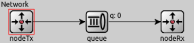  | 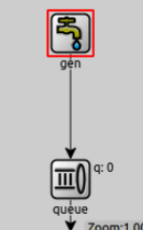 | 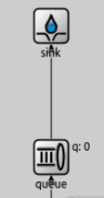  |

Cada arista del gráfico es un link o enlace que tendrá su propia velocidad de transmisión, y cada "cuadradito" de la network es un nodo.

Las queues utilizadas son lo que llamaremos buffers. Cuando llega un paquete a un buffer se pueden dar dos situaciones:

- Si el buffer tiene espacio, **almacena** la información que recibe hasta poder enviarla.
- Si no, **dropea** el paquete recibido causando una **perdida** del mismo pues _desaparece de la red_ ya que no hay nadie que se encargue de retransmitirlo.

Aquí los únicos paquetes que existen son paquetes de datos, hacen el recorrido ````gen -> NodeTxQueue -> queue -> NodeRxQueue -> sink```` o "transmisor -> red -> receptor" y no hay ninguna garantía del orden en el que se reciben, pero siempre se recibe el máximo posible (_min(generados, capacidad de la red)_).

### Análisis de la parte 1

Los siguientes gráficos muestran el tamaño del buffer en los distintos nodos de la red a medida que pasa el timepo de la simulación. Cada linea de color repsesenta una simulación corrida con el **generationInterval** en distribución exponencial sobre valor que se aclara en los gráficos.

### Caso 1: Congestión en el receptor
| NodeTx | Network Queue | NodeRx |
| ------ | ------------- | ------ |
| 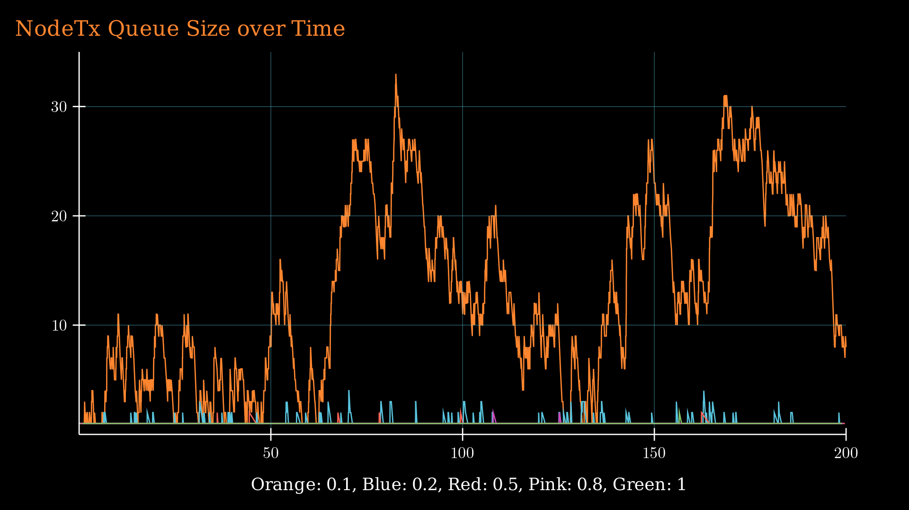 |  |  |

En este caso, el link de NodeTxQueue a NetworkQueue tiene un datarate de 1Mbps, al igual que el link de NetworkQueue a NodeRxQueue.
El link de NodeRxQueue a Sink tiene un datarate de 0.5Mbps.

Un paquete de 12500B tarda 0.1s en enviarse por un medio de 1Mbps y 0.2s por uno de 0.5Mbps. Esto explica por qué en el caso donde generamos un paquete cada 0.1s, el link de la NodeRxQueue a Sink se satura, ya que le llegan paquetes al doble de la velocidad en que los puede despachar. Los otros links no tienen problema, ya que despachan paquetes cada 0.1s entonces pueden manejar un tiempo de generación de un paquete cada 0.1s o más. Así determinamos que **el cuello de botella se encuentra en el link NodeRxQueue a Sink**.

Cuando enviamos cada 0.2s o más (lo que representa _menos_ paquetes por segundo), el cuello de botella desaparece, ya que el link más lento (0.5Mbps) puede despachar los paquetes a una velocidad mayor a la que le llegan.

En el caso de generar un paquete cada 0.1s, el tamaño del búffer del NodeTxQueue va variando sin llegar a llenarse. Esto es porque no generamos un paquete cada 0.1s exactamente, sino que hay un poco de aleatoriedad en ese número, entonces a veces mandamos un poco más rápido de lo que los puede procesar (y por lo tanto tienen que esperar en la cola, causando las subidas en el gráfico) y a veces un poco más lento (causando las bajadas).

Por el análisis realizado, concluimos que este caso es un problema de **congestión en el receptor**, por lo que se solucionará en la parte 2 con un algoritmo de **control de flujo**.


### Caso 2: Congestión en la red
| NodeTx | Network Queue | NodeRx |
| ------ | ------------- | ------ |
|  | 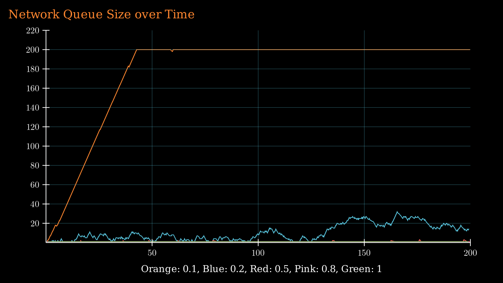 | 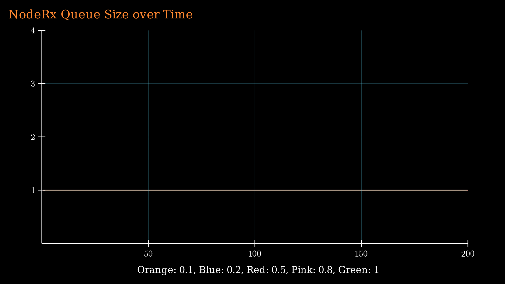 |

En este caso, el link de NodeTxQueue a NetworkQueue tiene un datarate de 1Mbps, al igual que el link de NodeRxQueue a Sink.
El link de NetworkQueue a NodeRxQueue tiene un datarate de 0.5Mbps.

La descripción del problema de este caso es la misma que para el caso 1, pero con **el cuello de botella en el link de NetworkQueue a NodeRxQueue** pues este es el enlace con menor capacidad de envío en la red y por consecuencia el que se satura. Por esta razón es que la red, es decir la _NetworkQueue_ es lo que se llena, en lugar de la _NodeRxQueue_ (caso 1).

Este es un problema de **congestión en la red**, entonces el algoritmo de **control de congestión** en la parte 2 lo intentará mitigar.

## Parte 2

### Descripción de la red de la parte 2

La red que utilizamos para el análisis de esta parte está descrita por los siguientes gráficos:

| Network | NodeTx | NodeRx |
| ------ | ------------- | ------ |
| 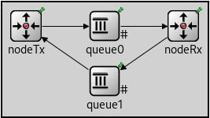  | 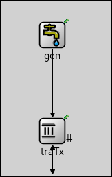 | 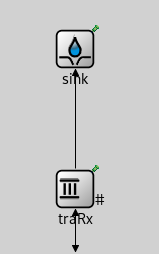  |

Nuevamente, cada arista del gráfico es un link o enlace que tendrá su propia velocidad de transmisión, y cada "cuadradito" de la network es un nodo.

Los paquetes de datos harán el recorrido ````Gen -> TraTx -> Queue0 -> TraRx -> Sink````.

En esta parte, agregamos paquetes de **feedback** que serán útiles en la implementación de nuestros algoritmos de control de flujo y congestión. Estos harán el recorrido ````TraRx -> Queue1 -> TraTx````.

En esta parte, los 'buffers' de la network serán:

- TraTx : Almacena información que recibe del generador para enviarla a la red cuando lo considere oportuno. Tambíen recibe los paquetes de feedback.
- Queue0 : Representa una 'red' con capacidad limitada.
- TraRx : Almacena información que recibe del la 'red' para enviarla al Sink o 'capa de aplicación'. Se encarga de envíar los paquetes de feedback.

Cuando llega un paquete a un buffer se pueden dar dos situaciones: 

- Si el buffer tiene espacio, **almacena** la información que recibe hasta poder enviarla.
- Si no, **dropea** el paquete recibido, pero a diferencia de la parte 1, esto **NO CAUSA** una **perdida** del mismo pues _sigue existiendo en la red_ y será retransmitido. Esto es gracias a los algoritmos que implementamos y describiremos a continuación.

Como queue1 siempre tiene transmisión instantanea y sólo recibirá paquetes de feedback de a uno, no lo consideramos como un buffer pues nunca almacenará los datos que recibe.


### Objetivos que establecimos
- Entregar los paquetes generados de forma que no se pierda ninguno y lleguen en orden al sink (algoritmo de entrega confiable).
- Controlar la congestión de la red, es decir, evitar enviar a 'queue0' más de lo que puede recibir (algoritmo de control de congestión).
- Controlar la congestión del receptor, es decir, evitar que al mismo le lleguen paquetes más rápido de lo que los puede procesar (algoritmo de control de flujo).


### Entrega confiable

Para esta parte agregamos un campo ````seqNumber```` a los paquetes transmitidos, de esta forma el receptor nos podrá confirmar cada paquete que recibe individualmente.
Tambien utilizamos los mensajes de tipo ````FeedbackPkt```` los cuales contienen un ACK (en el campo ````ackNumber````) con el número de secuencia del paquete del que confirman su recepción y también un campo ````windowStart````, que representa el último numero de secuencia ya recibido y entregado a la capa de aplicación.

Nuestro algoritmo es similar a _Selective Repeat_. El transmisor (traTx) tiene una ventana de salida, donde se podrán encontrar paquetes en los siguientes estados:

- Listos para ser enviados.
- Enviados y aún no confirmados.
- Enviados y confirmados fuera de orden.

El receptor (traRx) tiene una ventana de entrada con paquetes en los siguientes estados:

- Recibidos y aún no enviados al sink.
- No recibidos

Para confirmar la recepción de un paquete de datos, el receptor envía un FeedbackPkt con un ACK number igual al sequence number del paquete que recibió.

>\>$ alias reconocido="ackeado"

Acciones del TRANSMISOR (````traTx````): 

- Cuando **recibe un paquete del generador**, le asigna un ````seqNumber```` y lo almacena en su buffer hasta que su ventana le permita enviarlo.

- Cuando **termina de transmitir cada paquete**, intenta enviar el siguiente, que será el primer paquete que esté "listo para ser enviado" en la ventana. Si no puede, simplemente espera hasta que la ventana de envío lo permita.

- Cuando **envía un paquete**, _no lo elimina de su buffer_, sino que agenda (schedulea) un evento Timeout para manejar el caso en el que haya que retransmitirlo por su pérdida.

- Cuando **recibe un FeedbackPkt**, lee el campo ````ackNumber```` y marca ese paquete como reconocido (````Status: Acked````). Aquí también utilizamos el campo ````windowStart```` para actualizar la ventana pues el valor del mismo (en este contexto) actúa como un ACK acumulativo.


### Control de Flujo
Nuestro algoritmo de control de flujo se puede caracterizar de la siguiente forma:

- **Transmisor y receptor** deben tener el **mismo tamaño de ventana**. En este caso está hardcodeado en omnetpp.ini, pero se podría implementar para que se negocie en un handshake inicial.
- El receptor envía en el campo ````windowStart```` de cada FeedbackPkt el último paquete enviado al sink, es decir, informa al transmisor sobre cuál es el primer paquete en su ventana.
- El transmisor se encarga de no llenar el búfer del receptor, sabiendo que solo puede enviar paquetes con numeros de secuencia menores o iguales que el valor ````windowStart + windowSize````.


### Control de Congestión

A diferencia del algoritmo de control de flujo, aquí no recibimos información sobre el estado de un buffer, pues la congestión que tratamos de resolver se encuentra en la red. Por esta razón decidimos utilizar el **algoritmo de Jacobson** visto en el teórico para **_estimar_** el estado de la red a partir de mediciones del tiempo que pasa entre que un paquete es enviado y la recepción de su feedback (_RTT_). Conociendo este valor, podemos calcular un tiempo de **timeout** apropiado para cada paquete. Si pasa más tiempo que el timeout estimado para recibir el feedback de un paquete, se asume que aumentó la congestión en la red y actúa el algoritmo expliado a continuación.

Nuestro transmisor implementa un algoritmo análogo a **TCP Tahoe**. Para esto, el transmisor tiene una ventana de congestión ````cwnd```` que dice la cantidad de paquetes que puede haber en la red:

- Empieza en **Slow Start(*)** hasta llegar al threshold ````ssthresh````.
- Al salir de Slow Start, entra en **Additive Increase(*)**.
- Cuando hay un timeout, el threshold se reduce a la mitad de la ventana de congestión actual, la ventana de congestión se establece en 1 y empieza de vuelta Slow Start.

\* Cada vez que se recibe un ACK, **Slow Start** hace ````cwnd += 1````, mientras que **Additive Increase**, en nuestra imlpementación, hace ````cwnd += 1/cwnd````.

### Análisis de la parte 2

Al igual que en la primera parte, comenzaremos graficando el uso de los buffers de la network a medida que pasa el tiempo de la simulación, para distintos valores de timepo de generación de paquetes.

### Caso 1: Congestión en el receptor
| NodeTx | Network Queue | NodeRx |
| ------ | ------------- | ------ |
| 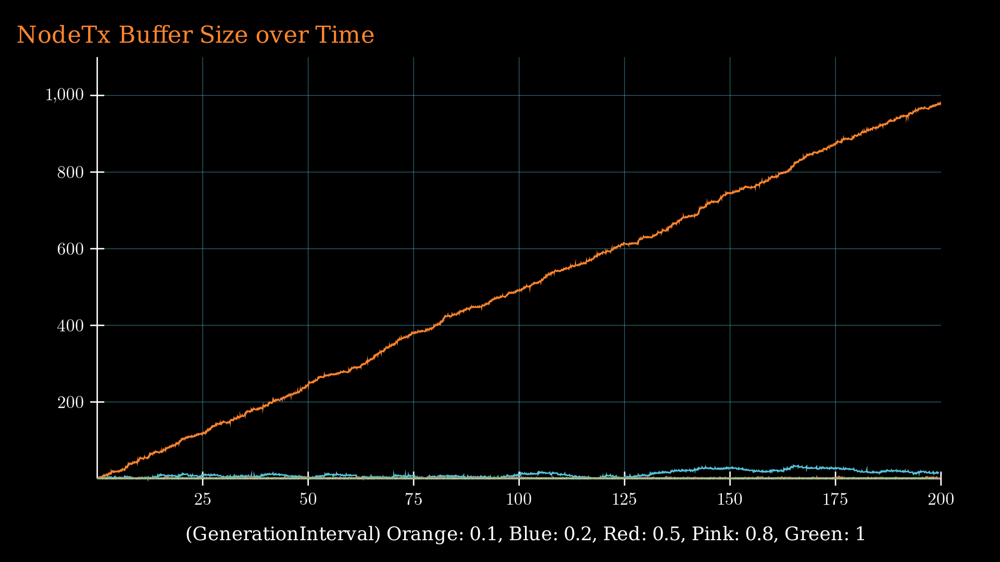 | 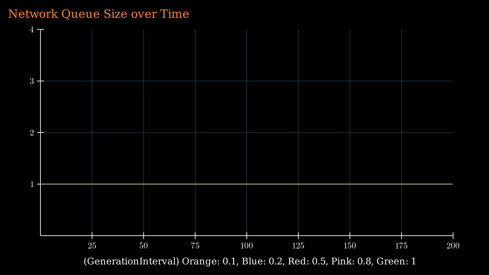 | 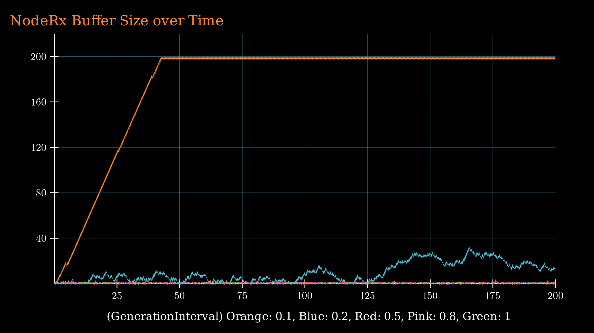 |

Aquí se ve claramente como el nodo transmisor regula la cantidad de paquetes que mete a la red, y por lo tanto su buffer de envío se llena a medida que va recibiendo paquetes, pues no siempre los está mandando al mismo ritmo.

|           Observación     |      Zoom-In del NodeRx     |
| ----------------------------------- | ----------------------------------- |
| Tambien se puede ver que a diferencia de [el caso 1 de la parte 1](#caso-1-congestión-en-el-receptor), cuando el buffer del receptor se está por llenar, el transmisor lo sabe gracias a nuestro [algoritmo de control de flujo](#control-de-flujo) y _no permite_ que esto suceda, pues nunca va a mandar más paquetes de los que la ventana del receptor le permite, esto se ve en la imagen de la derecha que es un zoom-in de el gráfico para NodeRx, cuando llega y frena antes del valor 200. | 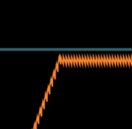 |

De esta manera logramos que siempre haya paquetes siendo enviados por el enlace más debil, y que nunca se sature un buffer.


### Caso 2: Congestión en la red
| NodeTx | Network Queue | NodeRx |
| ------ | ------------- | ------ |
| 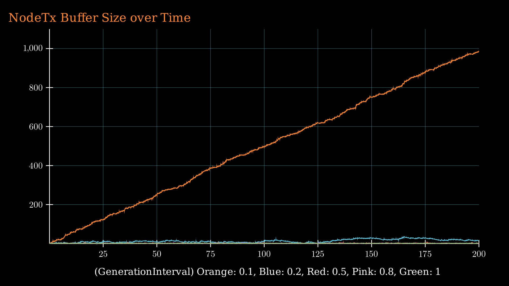 | 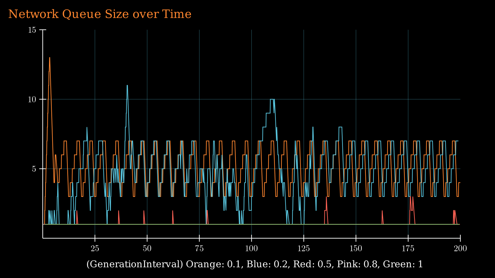 | 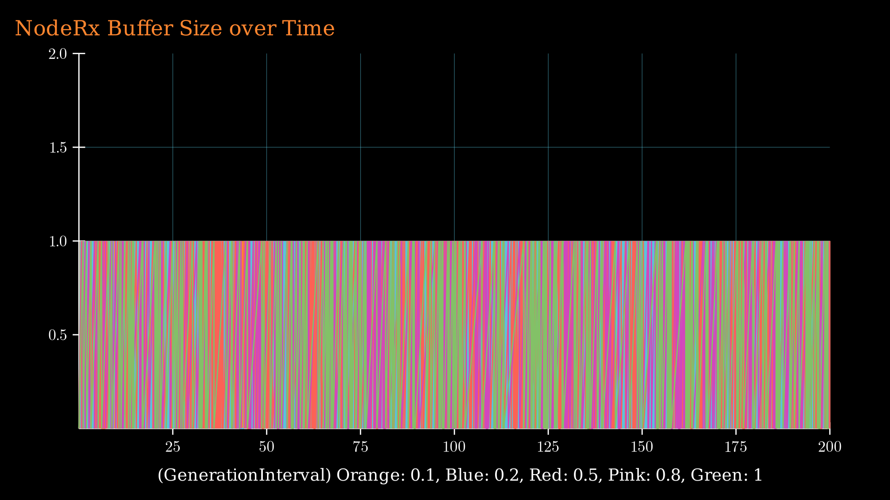 |

Al igual que en el caso anterior, se puede ver que la ocupación del buffer del NodeTx crece linealmente a medida que regula el ritmo con el que introduce paquetes a la red.

En este caso, actúa nuestro [algoritmo de control de congestión](#control-de-congestión) el cual no solo evita que se sature la "Network Queue", si no que tampoco permite que se vacíe, manteniendo así un aprovechamiento máximo de la red. El gráfico del NodeRx muestra que su tamaño de buffer se mueve constantemente entre 0 y 1, lo cual indica que este nodo **envía** correctamente todos los paquetes que le llegan, sin demoras, a la capa de aplicación.

En el caso 1, se saturaba el receptor y su buffer se mantenía casi lleno. En el caso 2, se satura la red pero su buffer no se mantiene "casi lleno", es más, ¡ni siquiera se acerca a ello! Esto sucede porque a diferencia del caso 1 donde podemos conocer la posición de la ventana actual del receptor y mantenerla casi llena, nos basamos en aproximar el valor de un RTT (round trip time) para estimar el estado de congestión de la red. Como el timeout de un paquete ocurre si este se mantiene más tiempo del que deseamos encolado en un buffer (_es decir, su RTT fue tan mayor al esperado que ocurrió un timeout antes de recibir su ACK_), el transmisor asume que se está sobrecargando la red e inmediatamente reduce su tasa de envío. Luego intenta darle una nueva oportunidad a la red, hasta que vuelva a ocurrir un timeout.

### Estimaciones del RTT y Jacobson

El siguiente gráfico muestra el valor estimado del RTT de la red (_en segundos_) durante simulaciones de 200 segundos de duración con distintos intervalos de generación de paquetes.

| Caso 1 | Caso 2 |
| ------ | ------ |
| 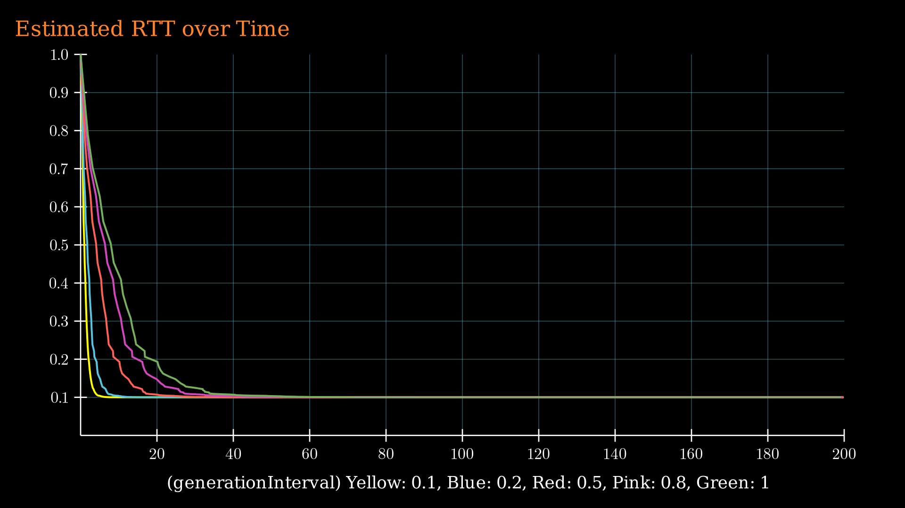 | 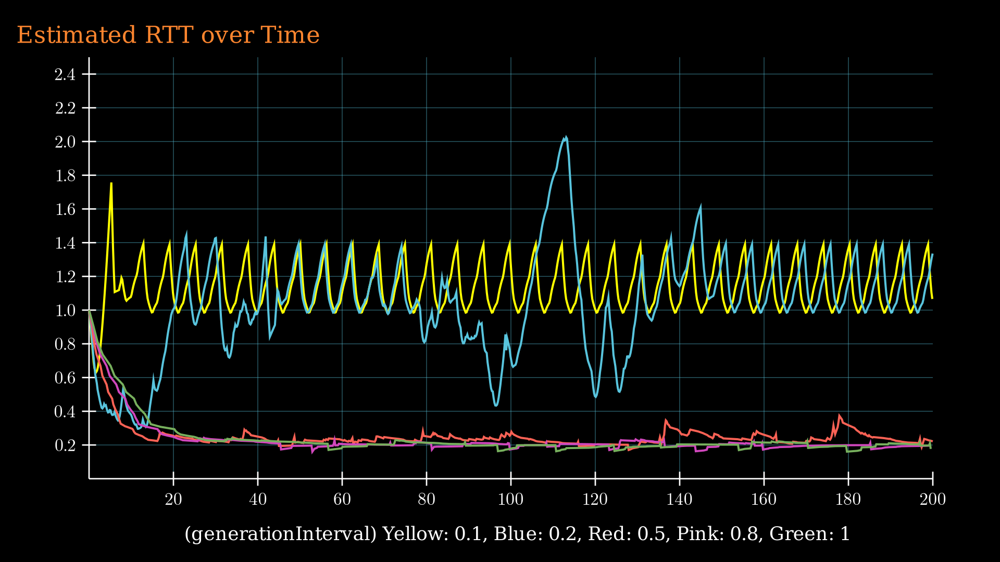 |

En el caso 1, el gráfico se aplana rápidamente pues no hay congestión en la red y por lo tanto el tiempo que tarda el transmisor en recibir el feedback de los paquetes enviados es aproximadamente constante (_esto está ligado a la ocupación de la red, y como se puede ver [en el análisis del caso 1](#caso-1-congestión-en-el-receptor-1), no tiene variación_). Notar que mientras menos paquetes se generan por segundo, más tardamos en aproximar el estado real de la red debido a que la estimación del RTT definida en el algoritmo de Jacobson se construye a partir de las mediciones de RTT de muchos paquetes.

Como se puede ver en el caso 2, el algoritmo de control de congestión actúa a la par del algoritmo de jacobson para evitar que el RTT de la red se eleve a niveles no deseados, debido a que esto podría significar que se está sobrecargando algún buffer. Notar que aquí el RTT estimado varía durante la simulación pues el tiempo que pasa desde que un paquete es enviado hasta que se recibe su feedback deja de ser aproximadamente constante (_recordar que esto está ligado a la ocupación de la red, y en este caso sí tiene variación, como se puede ver [en el análisis del caso 2](#caso-2-congestión-en-la-red-1)._). A continuación se puede observar más en detalle como actúan estos algoritmos en conjunto para mantener la red ocupada pero sin sobrecargarla.

| Jacobson en acción | Caso 2 con generationInterval = 0.1 |
| ------------------ | ----------------------------------- |
| Aquí se puede ver claramente cómo actúa el algoritmo de Jacobson junto al control de congestión. Ambos ejes están en segundos. En el eje horizontal se encuentra el tiempo transcurrido de la simulación, mientras que en el eje vertical se comparan el RTT estimado (_amarillo_) y el Timeout establecido (_azul_), ambos calculados por el el algoritmo de Jacobson. Como se puede observar, el Timeout se mantiene _por encima_ de las estimaciones del RTT. Esto es para evitar timeouts prematuros, pues si se sabe que la red se está congestionando, los próximos paquetes a enviar tendrán un timeout asociado que lo tendrá en cuenta. Si de todos modos ocurre un timeout, es decir, la red se está congestionando demasiado, se puede ver como ambos valores caen debido a las decisiones tomadas por el algoritmo de control de congestión. | 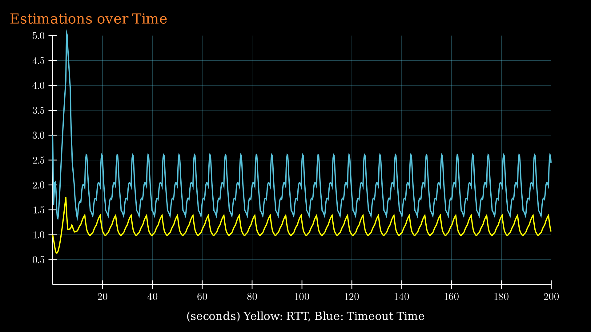 |


## Comparaciones

### Generados, Enviados y Recibidos
Uno de los gráficos más interesantes que obtuvimos es el que compara paquetes generados, paquetes introducidos a la red, y paquetes recibidos durante 200 segundos de simulación. Para estas comparaciones establecimos el generationInterval en ````exponential(0.1)````, lo cual mantiene una tasa de generación de ~10 paquetes por segundo.

| Parte 1 (ambos casos) | Parte 2 Caso 1 (congestión en el receptor) | Parte 2 Caso 2 (congestión en la red) |
| --------------------- | ------------------------------------------ | ------------------------------------- |
| 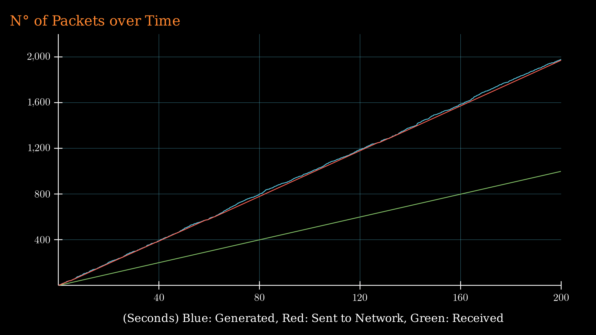 | 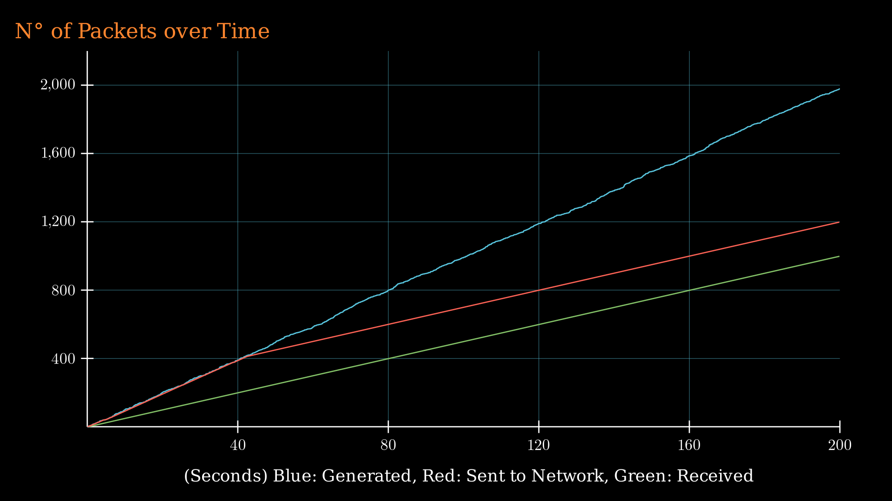 | 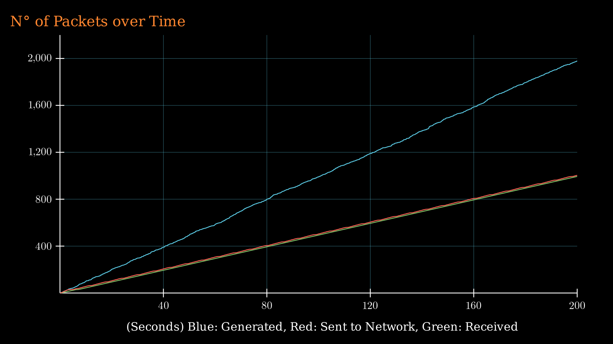 |

En la parte 1, como no hay ningún tipo de control, los paquetes que se introducen a la red son los mismos que los generados y por lo tanto se congestiona algún buffer, pues la red no es capaz de manejar esa cantidad de paquetes a la vez. Podemos comprobar con el gráfico de esta parte que el límite de la red es efectivamente transmitir ~1000 paquetes en 200seg, pues uno de los enlaces tan solo puede enviar datos a 0.5Mbps = 5 paquetes por segundo (12500B = 0.1Mb por paquete) y, como siempre le llegarán de más, su utilización se mantiene al máximo.

A diferencia de lo anterior, en la Parte 2 del proyecto están actuando nuestros algoritmos de control de flujo y congestión, que aprenden y se mantienen informados del estado aproximado de la red durante la simulación. Gracias a estos algoritmos, la cantidad de paquetes que se introducen a la red **_se balancea_** con la cantidad de paquetes que salen de la red _(notar la adaptación de la pendiente roja a la verde)_. Esto logra que **ningun buffer intermedio se sature** y pierda paquetes. También se consigue que el nodo que generaba el cuello de botella, es decir, el **nodo más debil de la red**, [**se mantenga ocupado siempre en ambos casos**](#análisis-de-la-parte-2). Ambos logros implican que mantuvimos el aprovechamiento de la red al máximo, **sin pérdida de paquetes**, y asegurando que **todos los paquetes llegan en orden**.

La diferencia entre el segundo y tercer gráfico, es que **cuando el problema de congestión se encuentra en el receptor (caso 1)**, nuestro [**algoritmo de control de flujo**](#control-de-flujo) permite **casi** llenar su buffer y luego trabaja de una manera similar a parada y espera, donde sólo manda paquetes de a 1 para [**mantener el buffer del receptor en su límite**](#caso-1-congestión-en-el-receptor-1), pero nunca pasarse de él _(observar la curva roja alcanzando y manteniendose 200 paquetes por encima de la verde, donde 200 es justamente el tamaño del buffer del receptor)_. En cambio, **cuando el problema se encuentra en la red (caso 2)**, nos enteramos del límite antes de estar cerca de saturar cualquier buffer, pues [**nuestro algoritmo de control de congestión**](#control-de-congestión) actúa apenas ocurre el primer timeout _(observar que la curva roja se adapta a la verde en los primeros segundos de la simulación, y luego se mantiene a la par)_. Esto también se puede ver en [**el segundo gráfico del caso 2 de la parte 2**](#caso-2-congestión-en-la-red-1) pues cuando el tamaño de la _NetworkQueue_ llega a ~13 en los primeros segundos (aunque su capacidad sea 200), el algoritmo se da cuenta de que la tasa de envío es demasiado alta y nunca más se pasa de ese valor.

\* cuando hacemos referencia a gráficos anteriores, se deben observar aquellos que representen un intervalo de generación de ~0.1 segundos pues este es el caso más interesante para el análisis actual.

### Delay entre Generador y Sink
Este gráfico representa los valores promedio de delay obtenidos luego de simulaciones de 200 segundos. En el eje x se encuentra la cantidad de paquetes enviados por segundo, y en el eje y el valor de delay promedio obtenido.

|     Ambos casos de ambas partes     |
| ----------------------------------- |
| 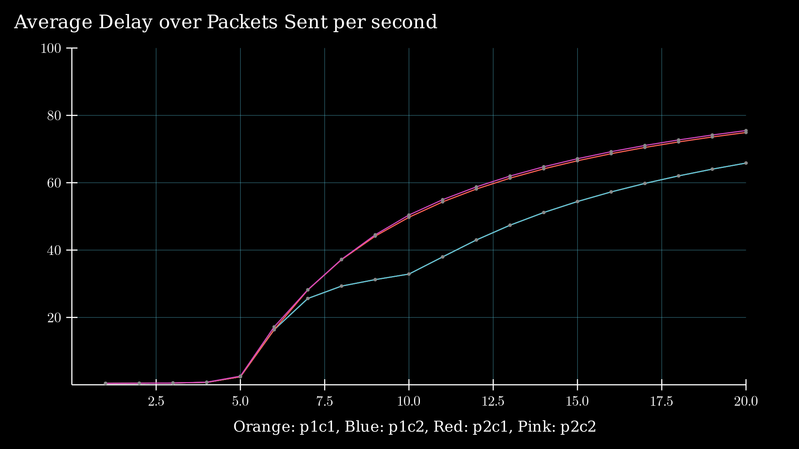 |

En este gráfico se pueden observar **tres intervalos importantes** en la cantidad de paquetes enviados:

- **Intervalo 1..5:** aquí todos los casos son iguales pues la red no sufre de problemas de congestión. Esto es porque la cantidad de paquetes generados es menor a la capacidad máxima de la red (_5pkts/s_) y por lo tanto los algoritmos de la parte 2 no tienen efecto.
- **Intervalo 5..10:** a partir de 5pkts/s se alcanza la capacidad de transmisión máxima de la red, lo que significa que algunos paquetes deben esperar en colas y por lo tanto empiezan a tener mucho más retardo. Ahora bien, también notamos una diferencia entre la parte 1 y la parte 2 (los casos dentro de cada parte son indiferenciables). Esta diferencia se debe a que en la parte 1 muchos paquetes se pierden y por lo tanto no contribuyen al retardo promedio. En cambio, en la parte 2, debido al control de congestión y al control de flujo, muchos paquetes tienen que esperar un tiempo extra antes de ser transmitidos, y por lo tanto llegan con más retardo.
- **Intervalo 10..:** las curvas de la parte 2 siguen las misma tendencia, mientras que las de la parte 1 muestran un cambio: a partir de 10pkts/s, la generación de paquetes supera la capacidad de envío del transmisor (NodeTx), entonces su buffer se empieza a llenar y por lo tanto los paquetes generados tienen que esperar cada vez más para salir del transmisor. Sigue habiendo una pequeña diferencia entre la parte 1 y la parte 2 debido a lo mencionado anteriormente sobre los controles de congestión y de flujo.

### Carga Ofrecida contra Carga Util
El siguiente gráfico muestra la cantidad de paquetes generados por segundo en el eje x, y la cantidad de paquetes recibidos por segundo en el eje y. Se corrieron varias simulaciones _(cada punto del gráfico representa una de ellas)_ para cada parte y caso del laboratorio.

|         Ambos casos de ambas partes          |
| -------------------------------------------- |
| 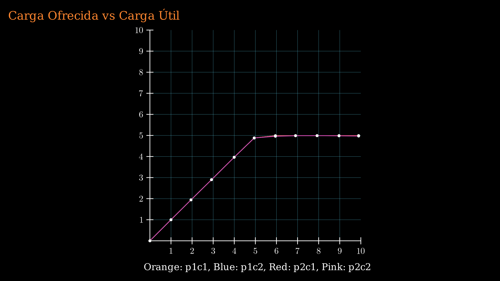 |

Como se puede observar, no hubo cambios en cuanto a la relación entre paquetes generados y recibidos entre la parte 1 y 2, debido a que en todos los casos se logra un aprovechamiento máximo de la red. Esto significa que nuestros algoritmos de confiabilidad, control de flujo y control de congestión _no tuvieron_ un costo notable en el desempeño de la red, aun logrando garantizar que no se pierdan paquetes y que por consecuenia _todos ellos lleguen en el orden que fueron generados_.

### Paquetes Perdidos
En la parte 1 del laboratorio, por más de que la cantidad de paquetes entregados sea la misma que en la parte 2, muchos paquetes son perdidos en el proceso. Esto ocurre debido a que el nodo mas débil de la red se congestiona pero nunca deja de recibir paquetes, por lo tanto los debe rechazar y eliminar o "droppear".

Como se vió a lo largo del informe, en la parte 2 logramos evitar por completo la pérdida de paquetes, pues los mismos _no se introducen a la red_ cuando existe algún riesgo de ser perdidos.

## Conclusiones del laboratorio
- Logramos **controlar la congestión, evitando la pérdida de datos y brindando confiabilidad** en una red simple, con un protocolo que combina varias de las cosas vistas en el teórico.
- El uso del protocolo creado _no generó un **overhead** notable_, al menos en esta red.
- Una parte muy importante en el desarrollo de protocolos es el **_análisis de los resultados_**. De esta forma podemos determinar los puntos fuertes del algoritmo desarrollado. En este lab, dicho análisis nos llevó casi el mismo tiempo que la parte de desarrollo.
- **"Del dicho al hecho hay mucho trecho"**. Es decir, a veces cuando estudiamos en el teórico las diferentes formas de resolver una problemática, pueden llegar a parecer algo "sencillas". Sin embargo, al ponernos manos a la obra e intentar plasmar nuestros conocimientos en la realidad, nos dimos cuenta de que hay muchos detalles de implementación que en un primer momento pasamos por alto.

## Algunas Observaciones
- En la implementación actual del control de flujo, existe la posibilidad de que ocurra un deadlock. Esto se podría resolver haciendo que el emisor le pregunte periódicamente al receptor si se liberó algún buffer. Por simplicidad, no lo resolvemos.
- Estaría bueno testear nuestro algoritmo en una red donde los paquetes de feedback viajen por el mismo lugar que los paquetes de datos.
