# Redes y Sistemas Distribuidos - Informe del Laboratorio 3

## Indice
* [Introducción](#introducción)
* [Definiciones](#definiciones)
* [Parte 1](#parte-1)
    * [Descripción de la red](#descripción-de-la-red-de-la-parte-1)
    * [Implementación](#implementación-de-la-parte-1)
    * [Analisis](#análisis-de-la-parte-1)
* [Parte 2](#parte-2)
    * [Objetivos Establecidos](#objetivos-que-establecimos)
    * [Entrega de datos confiable](#entrega-confiable)
    * [Control de Flujo](#control-de-flujo)
    * [Control de Congestión](#control-de-congestión)
    * [Analisis](#análisis-de-la-parte-2)
* [Conclusiones](#conclusiones)
* [Posibles Mejoras](#posibles-mejoras)

## Introducción
El objetivo de este laboratorio era analizar los datos de una red y proveer algoritmos de control de flujo y congestión para mejorar el desempeño de la misma. Este informe explica en detalle cada parte del laboratorio, junto con el análisis correspondiente y nuestras conclusiones finales.

### Integrantes del grupo:
```` 
for (std::string apellido : ["Achával", "Maraschio", "Peyronel"])
      printf("Tomás %s\n", apellido)
````

## Definiciones
Haremos referencia a las siguientes definiciones a lo largo del informe.
* **Transmisor:** Este término hará referencia al nodo que **envía** los paquetes de **datos**.
* **Receptor:** Este término hará referencia al nodo que **recibe** los paquetes de **datos**.
* **Buffer:** Estructura de datos que puede almacenar información.
* **Congestión:** Un nodo de la red está _congestionado_ si su buffer se llenó por recibir más datos de los que puede enviar.
* **Paquete dropeado:** Esto describe el hecho de que, por congestión en algún buffer, se descarta un paquete.
* **Paquete perdido:** Consideramos que un paquete fue _perdido_ cuando _**deja de existir en la red antes de llegar a su destino**_.

## Parte 1

### Implementación de la parte 1

### Descripción de la red de la parte 1

La red que utilizamos para el análisis de esta parte está descrita por los siguientes gráficos:

| Network | NodeTx | NodeRx |
| ------ | ------------- | ------ |
| 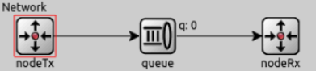  | 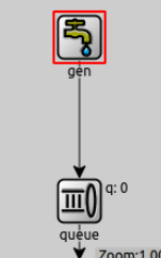 | 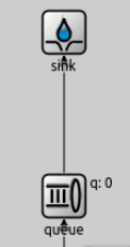  |

Cada arista del gráfico es un link o enlace que tendrá su propia velocidad de transmisión, y cada "cuadradito" de la network es un nodo.

Las queues utilizadas son lo que llamaremos buffers. Cuando llega un paquete a un buffer se pueden dar dos situaciones: 
- Si el buffer tiene espacio, **almacena** la información que recibe hasta poder enviarla.
- Si no, **dropea** el paquete recibido causando una **perdida** del mismo pues _desaparece de la red_ ya que no hay nadie que se encargue de retransmitirlo.

### Análisis de la parte 1

Los siguientes gráficos muestran el tamaño del buffer en los distintos nodos de la red a medida que pasa el timepo de la simulación. Cada linea de color repsesenta una simulación corrida con el **generationInterval** en distribución exponencial sobre valor que se aclara en los gráficos.

### Caso 1: Congestión en el receptor
| NodeTx | Network Queue | NodeRx |
| ------ | ------------- | ------ |
|  |  |  |

En este caso, el link de NodeTxQueue a NetworkQueue tiene un datarate de 1Mbps, al igual que el link de NetworkQueue a NodeRxQueue.
El link de NodeRxQueue a Sink tiene un datarate de 0,5Mbps.

Un paquete de 12500B tarda 0,1s en enviarse por un medio de 1Mbps y 0,2s por uno de 0,5Mbps. Esto explica por qué en el caso donde generamos un paquete cada 0,1s, el link de la NodeRxQueue a Sink se satura, ya que le llegan paquetes al doble de la velocidad en que los puede despachar. Los otros links no tienen problema, ya que despachan paquetes cada 0,1s entonces pueden manejar un tiempo de generación de un paquete cada 0,1s o más. Así determinamos que el cuello de botella se encuentra en el link NodeRxQueue a Sink.

Cuando enviamos cada 0,2s o más (lo que representa _menos_ paquetes por segundo), el cuello de botella desaparece, ya que el link más lento (0,5Mbps) puede despachar los paquetes a una velocidad mayor a la que le llegan.

En el caso de generar un paquete cada 0,1s, el tamaño del búffer del NodeTxQueue va variando sin llegar a llenarse. Esto es porque no generamos un paquete cada 0,1s exactamente, sino que hay un poco de aleatoriedad en ese número, entonces a veces mandamos un poco más rápido de lo que los puede procesar (y por lo tanto tienen que esperar en la cola, causando las subidas en el gráfico) y a veces un poco más lento (causando las bajadas).

Por el análisis realizado, concluimos que este caso es un problema de **congestión en el receptor**, por lo que se solucionará en la parte 2 con un algoritmo de **control de flujo**.


### Caso 2: Congestión en el router
| NodeTx | Network Queue | NodeRx |
| ------ | ------------- | ------ |
|   | 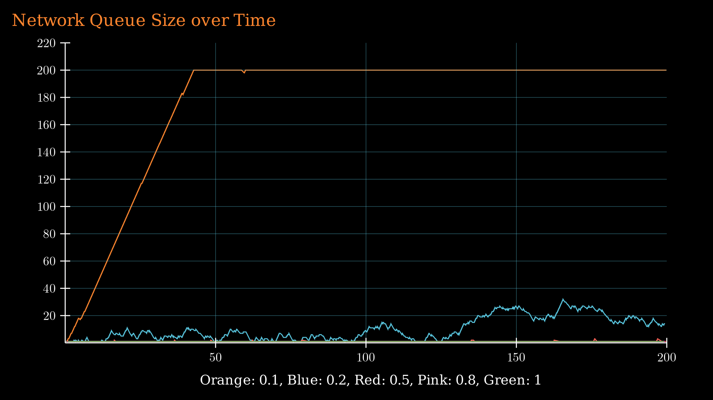 | 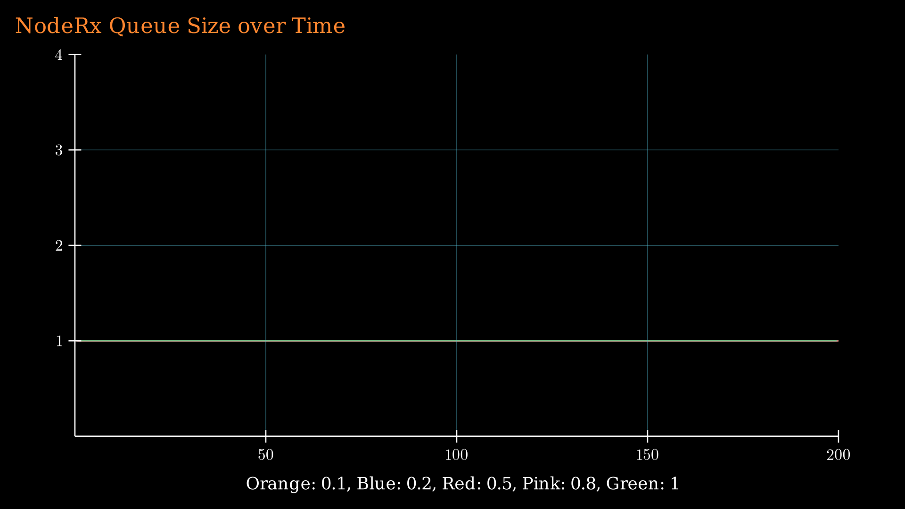  |

En este caso, el link de NodeTxQueue a NetworkQueue tiene un datarate de 1Mbps, al igual que el link de NodeRxQueue a Sink.
El link de NetworkQueue a NodeRxQueue tiene un datarate de 0,5Mbps.

Acá es igual que arriba, pero el cuello de botella está en el link NetworkQueue a NodeRxQueue.

Este es un problema de **congestión en la red**, entonces el algoritmo de **control de congestión** en la parte 2 lo intentará mitigar.

## Parte 2


### Descripción de la red de la parte 2

La red que utilizamos para el análisis de esta parte está descrita por los siguientes gráficos:

| Network | NodeTx | NodeRx |
| ------ | ------------- | ------ |
| 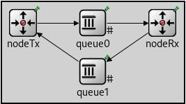  | 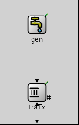 | 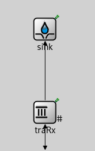  |

Nuevamente, cada arista del gráfico es un link o enlace que tendrá su propia velocidad de transmisión, y cada "cuadradito" de la network es un nodo.

Los paquetes de datos harán el recorrido ````Gen -> TraTx -> Queue0 -> TraRx -> Sink````.

En esta parte, agregamos paquetes de **feedback** que serán útiles en la implementación de nuestros algoritmos de control de flujo y congestión. Estos harán el recorrido ````TraRx -> Queue1 -> TraTx````.

En esta parte, los 'buffers' de la network serán:
- TraTx : Almacena información que recibe del generador para enviarla a la red cuando lo considere oportuno. Tambíen recibe los paquetes de feedback.
- Queue0 : Representa un 'router' con capacidad limitada.
- TraRx : Almacena información que recibe del 'router' para enviarla al Sink o 'capa de aplicación'. Se encarga de envíar los paquetes de feedback.

Cuando llega un paquete a un buffer se pueden dar dos situaciones: 
- Si el buffer tiene espacio, **almacena** la información que recibe hasta poder enviarla.
- Si no, **dropea** el paquete recibido, pero a diferencia de la parte 1, esto **NO CAUSA** una **perdida** del mismo pues _sigue existiendo en la red_ y será retransmitido. Esto es gracias a los algoritmos que implementamos y describiremos a continuación.

Como queue1 siempre tiene transmisión instantanea y sólo recibirá paquetes de feedback de a uno, no lo consideramos como un buffer pues nunca almacenará los datos que recibe.


### Objetivos que establecimos
- Entregar los paquetes generados de forma que no se pierda ninguno y lleguen en orden al sink (algoritmo de entrega confiable).
- Controlar la congestión de la red, es decir, evitar enviar a 'queue0' más de lo que puede recibir (algoritmo de control de congestión).
- Controlar la congestión del receptor, es decir, evitar que al mismo le lleguen paquetes más rápido de lo que los puede procesar (algoritmo de control de flujo).


### Entrega confiable

Para esta parte agregamos un campo ````seqNumber```` a los paquetes transmitidos, de esta forma el receptor nos podrá confirmar cada paquete que recibe individualmente.
Tambien utilizamos los mensajes de tipo ````FeedbackPkt```` los cuales contienen un ACK (en el campo ````ackNumber````) con el número de secuencia del paquete del que confirman su recepción y también un campo ````windowStart````, que representa el último numero de secuencia ya recibido y entregado a la capa de aplicación.

Nuestro algoritmo es similar a _Selective Repeat_. El transmisor (traTx) tiene una ventana de salida, donde se podrán encontrar paquetes en los siguientes estados:
- Listos para ser enviados.
- Enviados y aún no confirmados.
- Enviados y confirmados fuera de orden.

El receptor (traRx) tiene una ventana de entrada con paquetes en los siguientes estados:
- Recibidos y aún no enviados al sink.
- No recibidos

Para confirmar la recepción de un paquete de datos, el receptor envía un FeedbackPkt con un ACK number igual al sequence number del paquete que recibió.

>\>$ alias reconocido="ackeado"

Acciones del TRANSMISOR (````traTx````): 
- Cuando **recibe un paquete del generador**, le asigna un ````seqNumber```` y lo almacena en su buffer hasta que su ventana le permita enviarlo.

- Cuando **termina de transmitir cada paquete**, intenta enviar el siguiente, que será el primer paquete que esté "listo para ser enviado" en la ventana. Si no puede, simplemente espera hasta que la ventana de envío lo permita.

- Cuando **envía un paquete**, _no lo elimina de su buffer_, sino que agenda (schedulea) un evento Timeout para manejar el caso en el que haya que retransmitirlo por su pérdida.

- Cuando **recibe un FeedbackPkt**, lee el campo ````ackNumber```` y marca ese paquete como reconocido (````Status: Acked````). Aquí también utilizamos el campo ````windowStart```` para actualizar la ventana pues el valor del mismo (en este contexto) actúa como un ACK acumulativo.


### Control de Flujo
Nuestro algoritmo de control de flujo se puede caracterizar de la siguiente forma:
- **Transmisor y receptor** deben tener el **mismo tamaño de ventana** En este caso está hardcodeado en omnetpp.ini, pero se podría implementar para que se negocie en un handshake inicial.
- El receptor envía en el campo ````windowStart```` de cada FeedbackPkt el último paquete enviado al sink, es decir, informa al transmisor cuál es el primer paquete en su ventana.
- El transmisor se encarga de no llenar el búfer del receptor, sabiendo que solo puede enviar paquetes con numero de secuencia menores o iguales que el valor ````windowStart + windowSize````.


### Control de Congestión
Nuestro transmisor implementa un algoritmo análogo a **TCP Tahoe**. Para esto, el transmisor tiene una ventana de congestión ````cwnd```` que dice la cantidad de paquetes que puede haber en la red:
- Empieza en **Slow Start(*)** hasta llegar al threshold ````ssthresh````.
- Al salir de Slow Start, entra en **Additive Increase(*)**.
- Cuando hay un timeout, el threshold se reduce a la mitad de la ventana de congestión actual, la ventana de congestión se establece en 1 y empieza de vuelta Slow Start.

\* Cada vez que se recibe un ACK, **Slow Start** hace ````cwnd += 1````, mientras que **Additive Increase**, en nuestra imlpementación, hace ````cwnd += 1/cwnd````.

### Análisis de la parte 2

Al igual que en la primera parte, comenzaremos graficando el uso de los buffers de la network a medida que pasa el tiempo de la simulación, para distintos valores de timepo de generación de paquetes.

### Caso 1: Congestión en el receptor
| NodeTx | Network Queue | NodeRx |
| ------ | ------------- | ------ |
| 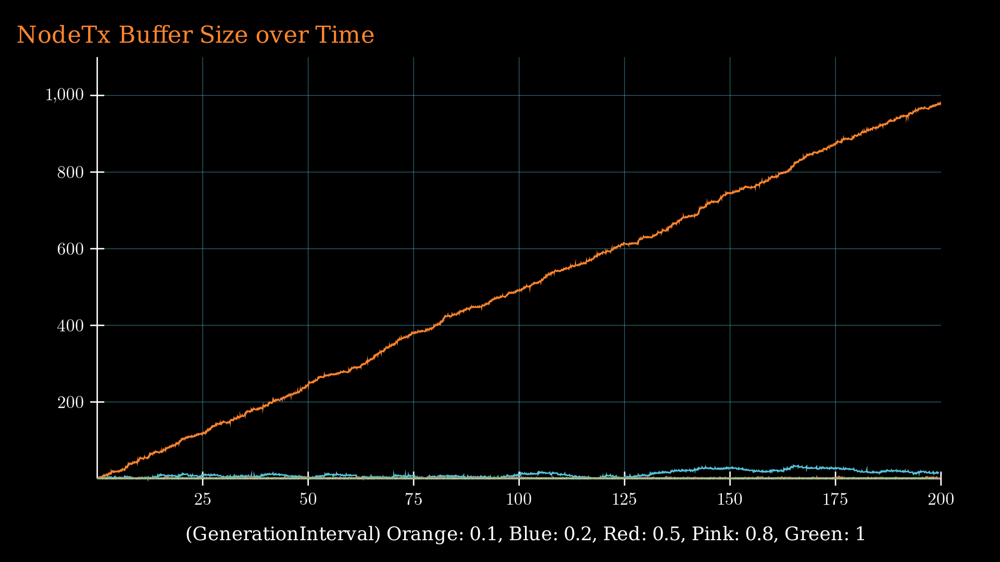 | 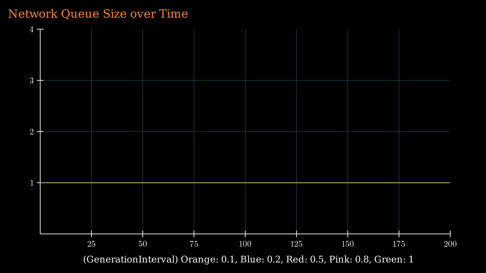 | 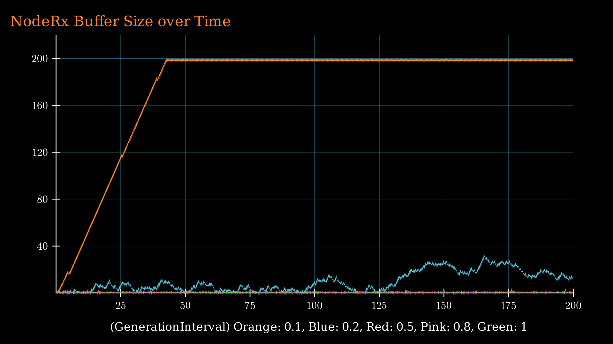 |

Aquí se ve claramente como el nodo transmisor regula la cantidad de paquetes que mete a la red, y por lo tanto su buffer de envío se llena a medida que va recibiendo paquetes, pues no siempre los está mandando al mismo ritmo.

Tambien se puede ver que a diferencia de [el caso 1 de la parte 1](#caso-1-congestión-en-el-receptor), cuando el buffer del receptor se está por llenar, el transmisor lo sabe y _no permite_ que esto suceda, pues nunca va a mandar más paquetes de los que la ventana del receptor le permite, esto se ve en la siguiente imagen que es un zoom-in de el gráfico para NodeRx.

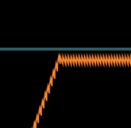

### Caso 2: Congestión en el router
| NodeTx | Network Queue | NodeRx |
| ------ | ------------- | ------ |
| 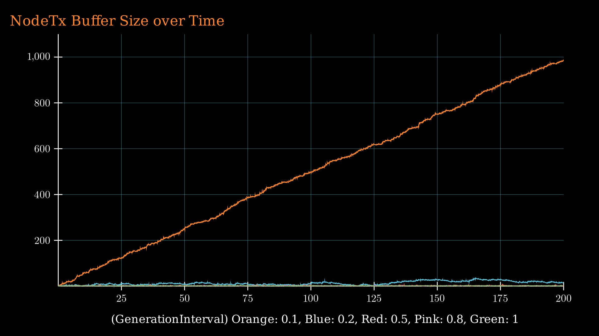 | 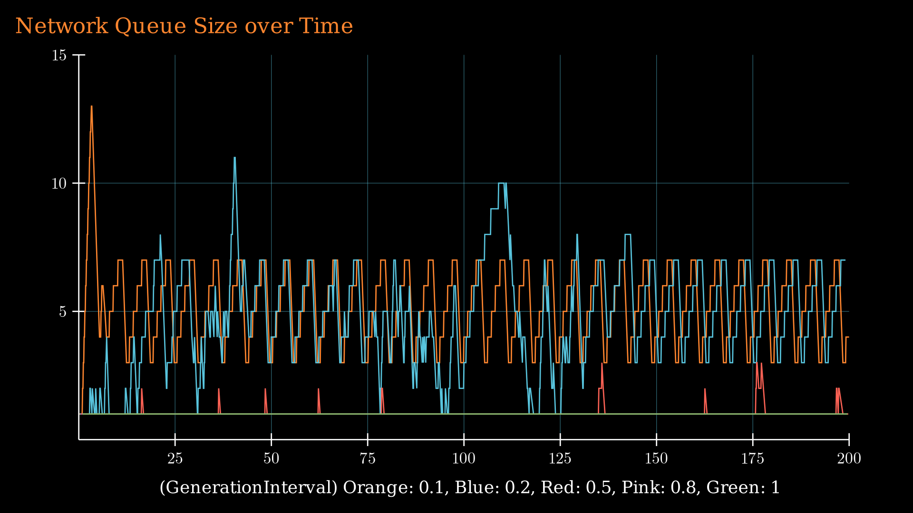 | 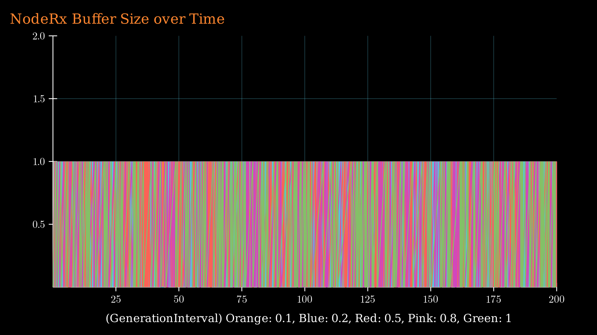 |

## Conclusiones
| Parte 1 (ambos casos) | Parte 2 Caso 1 (congestión en el receptor) | Parte 2 Caso 2 (congestión en la red) |
| --------------------- | ------------------------------------- | ------------------------------------------ |
| 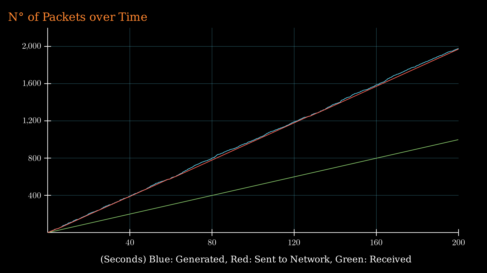 | 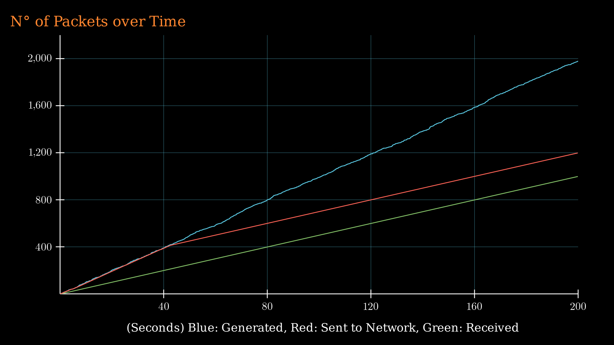 | 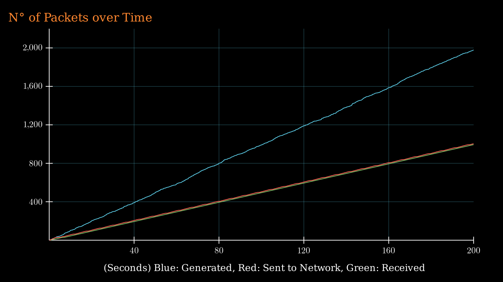 |

## Posibles Mejoras
- Enviar periódicamente el windowStart
